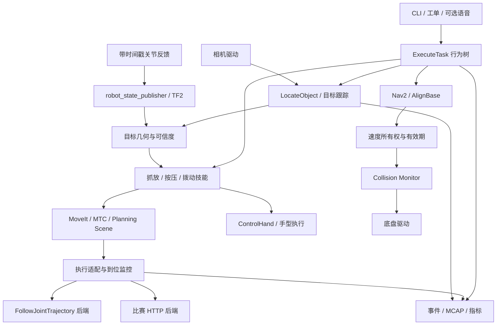

# Zzxrobot 企业级改进总体方案

版本：1.0。调研与本地核验日期：2026-09-19。

项目：`/home/zzx/vision_guided_manipulation`。源码基线：`50e9c2d`。

定位：基于 ROS 2 的视觉引导移动操作与工位作业平台，融合中控杯现场经验、原 LeoRobot 仿真项目和企业机器人软件工程方法。

本文交付的是设计与实施方案。下文明确标为“拟实现”的组件、指标和命令示例，均不代表当前仓库已经具备该能力。数值目标是首轮工程验收建议，须用基线实验校正，不能直接写成简历成果。

配套文件：[实施任务与验收清单](implementation_backlog.md)。推荐先读第 1、3、5、18、19 节，再按模块深入。

## 1. 项目应该做到什么程度

最值得做的主线是：**可复现运行的机器人系统 + 可取消恢复的 C++ 执行链 + 可靠 RGB-D 定位 + 有反馈验证的抓放与工位操作**。

把比赛中有效的观察位、过渡位、预抓位和完成位保留下来，升级成有状态、有坐标系、有环境版本的技能。全局运动由经过验证的路径和规划器负责，局部操作用视觉补偿。每一步都有明确的进入条件、执行结果、失败原因和退出条件。

项目分三个产品层次，避免把个人项目一次扩展成整家机器人公司的软件栈：

| 层次 | 要交付的能力 | 对应价值 |
|---|---|---|
| L1：可信工程基线 | 一键启动、配置统一、执行可取消、日志可回放、自动测试 | 能运行、能定位故障、别人能复现 |
| L2：自主移动操作 | 视觉定位、局部修正、MoveIt 抓放、抓取确认、失败恢复 | 有实质算法改进，适合面试与演示 |
| L3：企业集成验证 | 工单幂等、设备能力协商、发布回滚、工位握手、可选车队适配 | 展示面向交付和长期维护的工程判断 |

第一版验收场景选定为：机器人前往固定物料台，识别并搬运不透明规则物体，放置到指定区域，重新观察确认结果。面板按压/拨动作为第二类可复用技能。先实现“移动时收臂、操作时底盘停止”的分阶段协同，再研究边走边操作。

本地仿真可以完整验证 L1 和多数 L2。比赛真机 HTTP 后端可以验证协议、状态和已有技能，但没有真机、标定数据及机器人模型时，不能声称已完成真机视觉闭环或工业安全认证。

## 2. 调研方法与证据边界

### 2.1 本地依据

本次阅读并复核了以下资料：

- `D:/Desktop/zhongkong/final/LeoRobot项目深度剖析与二次开发方案.md`。
- `D:/Desktop/zhongkong/final/2027机器人岗位对标与本地项目重构方案.md` 的项目定位与能力边界。
- WSL 中 `Zzxrobot` 的视觉、导航、机械臂节点，URDF 和两套控制器配置。
- 新建 `zzx_interfaces` 的消息、服务、动作定义与 README。
- 决赛 `config/app.yaml`、`config/calibration.yaml`、`config/hardware_http.yaml` 及相机内参读取实现。
- 本次对话中真实返回的 HTTP 状态和现场故障记录。

原分析文档仍是上游模块说明的参考，但“依赖未安装”“另建 mobiman_ws”“接口尚未建立”等建议需要更新。现在沿用现有仓库、现有工作空间和 `zzx_` 命名；不再创建第二套平行项目。

### 2.2 外部资料的使用方式

采用厂商文档、官方源码、ROS/MoveIt/Nav2 文档和标准组织公开页面。厂商资料用于确认公开能力，不用于证明市场份额、实际可靠性或闭源算法细节。表中的“痛点”和“本项目取舍”是结合源码及比赛经历作出的工程推导。

部分 ROS 官网受到访问限制，使用其官方 GitHub 文档源核对。Rolling 文档只用于理解架构，不直接作为 Humble 配置模板。标准部分仅核验公开范围和版本，没有购买或逐条审查全文。

## 3. 当前基线：已经有的、缺少的、发现的问题

### 3.1 已有资产

| 资产 | 本次确认状态 | 后续处理 |
|---|---|---|
| Git 版本管理 | `main` 基线含 `50e9c2d` 统一接口提交 | 保持中文提交描述，按模块提交 |
| 仿真和规划依赖 | Nav2、Cartographer、Gazebo ROS、MoveIt、ros2_control 已安装 | 冻结环境清单，补干净环境重建 |
| `zzx_interfaces` | 3 msg、2 srv、5 action，已编译和自省 | 补语义、能力和契约测试 |
| 原型任务链 | 语音、视觉、导航、固定关节抓取节点存在 | 保留可复现基线，逐段替换 |
| 比赛任务 | 现场已经验证若干示教路径和手指动作 | 提取为机器人专属技能和测试样本 |
| 相机接入 | SDK、图像、深度统计、ChArUco 工具存在 | 校正几何前提并接入 ROS |

本机 APT 核验版本：MoveIt `2.5.9`、Nav2 bringup `1.1.20`、ros2_control `2.54.0`、gazebo_ros_pkgs `3.9.0`、Cartographer ROS `2.0.9002`。这是本机安装版本，不是推荐所有环境安装的“最新版本”。接口包测试通过不等于整机系统联调通过，旧包仍有测试文件损坏和格式测试失败的历史记录。

### 3.2 需要优先消除的代码问题

以下路径均相对 `ros2_ws/src/Zzxrobot/`：

| 优先级 | 证据位置 | 问题及直接影响 | 必要修复 |
|---|---|---|---|
| P0 | `mybot_description/urdf/six_arm.urdf:829` | 控制器 YAML 写死 `/home/leo/leofile/...` | 使用包资源路径和 xacro 参数 |
| P0 | `mybot_description/config/moveit_controllers.yaml:20` | 将 joint7/8 分给 arm controller，与实际分组冲突 | 统一机械臂/夹爪控制器映射 |
| P0 | `mybot_description/mybot_description/move_arm.py` | 初始化就发运动；用 sleep 推断执行成功 | 初始化不发动作，改 Action 和实测到位判断 |
| P0 | `mybot_description/mybot_description/navigate.py` | 导航等待结束就当成功，没有核对结果 | 明确成功、取消、超时、拒绝和失败 |
| P0 | `mybot_description/mybot_description/image_detection.py` | 对准完成条件要求有效深度小于 0 | 换成有效深度与误差门控 |
| P0 | 同上 | RGB/深度独立回调、最新 TF、单像素深度 | 同步、时间戳 TF、区域/掩膜深度 |
| P1 | `mybot_description/urdf/six_arm.urdf` | arm/gripper 全是 continuous | 区分真实无限旋转与有界关节，完善限位和碰撞模型 |
| P1 | 业务节点 | String/裸数组、GUI/推理/等待混在回调 | 类型化接口、异步执行器、独立推理工作线程 |
| P1 | 两套 `mybot*/config` | 配置重复，启动入口决定实际控制行为 | 一个权威描述及规划配置 |
| P1 | 上游语音与依赖 | 云凭据、TLS 校验、依赖/权重发布边界需治理 | 凭据外置、证书校验、下载清单与来源记录 |

### 3.3 比赛视觉代码中新增确认的阻塞项

当前 `final/config/app.yaml` 是 640×480、30 FPS，`align_depth_to_color: false`。保存的自定义内参是 1280×720 且 `enabled: false`。因此不能说当前正在错误使用那组自定义内参，但**直接启用它会引入分辨率/成像模式不匹配**。

`orbbec_gemini335.py` 在尺寸不一致时把深度图 resize 到目标尺寸。resize 只改变像素网格，不等价于利用深度到彩色外参做几何配准。新三维定位后端必须在注册深度或显式重投影完成后才读取 RGB 像素对应的深度。

`final/config/calibration.yaml` 中 `eye_in_hand.enabled: true`，但 `flange_to_camera` 的平移和旋转均为零且注释明确标为占位。**它不是可用手眼标定结果。** 程序具备矩阵相乘代码，不代表已具备准确的相机到机器人坐标转换。

这三项是视觉升级的前置条件。修复之前，示教技能只能按原已验证方式使用，不能把计算得到的三维点直接作为真机运动目标。

## 4. 成熟平台对标：学习什么，如何落到代码

| 平台/项目 | 可核验公开能力 | 对当前项目的启示与具体产物 | 实施顺序 |
|---|---|---|---|
| PAL TIAGo Pro | Nav2、MoveIt 2、ros2_control 组合的移动操作平台 | 以标准组件集成构建系统；产出统一 bringup 与 robot profile | 第一批 |
| Universal Robots ROS 2 Driver | 标准轨迹接口、速度缩放、控制器侧执行等模式 | 区分计划和实际执行，显式声明后端能力；产出 execution monitor | 第一批 |
| Nav2 | 生命周期管理、插件化导航、碰撞监视 | 导航结果验证、底盘命令仲裁、失联停止；产出 navigation adapter | 第一批 |
| MoveIt Pro | 技能与行为树组合，任务结构可视化 | 学习技能复用和失败分支；采用开源 BT.CPP + Action 实现自身执行器 | 第二批 |
| MoveIt Task Constructor | 分阶段抓放规划 | 把 approach、grasp、lift、place、retreat 分别定义并检查 | 第二批 |
| MiR / MiR Fleet | 机器人和车队 REST API 集成 | 工单 ID、异步状态、企业接口与底层执行分离 | 第三批 |
| Open-RMF | 异构车队、资源与交通协调 | 先保留任务/位置/电量适配点，多机器人时再引入 | 后置选修 |
| Foxglove / MCAP | 实时数据可视化与录制回放 | 图像、TF、轨迹、日志同一时间线；产出诊断布局与故障包 | 第一批 |
| Isaac ROS Manipulation / nvblox | 感知、局部三维重建等参考流程 | 在基础几何方案后测动态场景需求和 GPU 预算 | 后置选修 |
| Hugging Face LeRobot | 机器人学习与数据集工具 | 有可靠示教数据后，独立做策略基线并与几何方案比较 | 后置选修 |

对应官方资料：[TIAGo Pro](https://pal-robotics.com/robot/tiago-pro/)、[UR 控制方式](https://docs.universal-robots.com/Universal_Robots_ROS_Documentation/rolling/doc/ur_robot_driver/ur_robot_driver/doc/usage/position_velocity_control.html)、[Nav2 生命周期](https://docs.nav2.org/rolling/configuration_and_development/configuration_guide/core_servers/configuring_lifecycle_manager/)、[MoveIt Pro 行为树](https://docs.picknik.ai/concepts/behavior_trees/)、[MiR 软件集成](https://academy.mobile-industrial-robots.com/free-skill-paths/software-integration/)、[Open-RMF](https://github.com/open-rmf/rmf_demos)、[Foxglove ROS 2](https://docs.foxglove.dev/docs/getting-started/frameworks/ros2)、[Isaac Manipulation](https://nvidia-isaac-ros.github.io/reference_workflows/isaac_for_manipulation/index.html)、[LeRobot](https://github.com/huggingface/lerobot)。

由上述设计和比赛故障推导，落地最重要的痛点是：现场配置漂移、执行状态不可见、坐标与时间不一致、失败后重复动作、长时间运行资源累积、现场数据无法复现。换更大的检测网络通常解决不了这些问题。

### 4.1 首版必须控制的范围

先完成规则物体、已知工作台、单机器人、局部静态环境。暂不把人形全身控制、无约束灵巧操作、VLA 训练、多机器人车队、透明物体和精密插装放到首版必做项。每个扩展都应由失败样本或业务需求触发，而不是因为技术热门。

## 5. 版本、语言和目录决策

### 5.1 ROS 与仿真版本

截至调研日，官方发行表列出 Humble 支持至 2027-05，Jazzy 至 2029-05，Lyrical 至 2031-05；Gazebo Classic 已于 2025-01 结束维护。Jazzy 与 Harmonic 是官方支持组合。[ROS 发行表](https://docs.ros.org/en/humble/Releases.html)、[Classic 迁移公告](https://community.gazebosim.org/t/gazebo-classic-end-of-life-and-migration-survey/2483)、[ROS/Gazebo 配对](https://gazebosim.org/docs/harmonic/ros_installation/)。

本项目决策：

1. 现有 Humble 环境用于复现和最小契约验证，保存依赖版本。
2. 首个可靠执行样例通过后，在独立工作树及 Ubuntu 24.04 环境迁移 Jazzy + Harmonic。
3. 迁移通过相同数据集和场景验收后，新模块以 Jazzy 为主；Humble 保留为历史复现线。
4. Lyrical 作为技术预研候选，需要确认相机 SDK、MoveIt、控制器、Gazebo 插件的整套兼容矩阵后决定。不能把“最新”直接等同于最适合本项目。

Classic 的世界文件、传感器插件、`gazebo_ros2_control`、`gazebo_grasp_fix` 都要逐项迁移。替代路线为 Gazebo Sim 系统、`ros_gz`、`gz_ros2_control`；旧抓取粘附插件不能假设直接可用。新增 `physics_contact` 与明确标记的 `assisted_grasp` 两套评测，避免把插件粘附成功当成真实抓取成功。

### 5.2 Python 和 C++ 分工

| 模块 | 首选语言 | 原因 |
|---|---|---|
| 执行监控、底盘对准、命令仲裁 | C++17 / rclcpp | 易于明确线程、资源与时限 |
| MoveIt/MTC、场景管理、TF 几何核心 | C++ | 接口和性能工具链匹配 |
| 行为树叶节点与任务执行器 | C++ | 统一异步取消和任务结果 |
| 相机驱动 | 官方 ROS 2 驱动优先 | 减少自行维护 SDK 线程与时间同步 |
| 检测、训练、标定、离线分析 | Python | 迭代便利，复用模型与 OpenCV 工具 |
| HTTP 旧后端 | 先 Python 独立节点 | 复用已验证协议，再依据性能证据决定迁移 |
| 基准、报告、数据导出 | Python | 自动化分析方便 |

C++ 不会自动带来实时性。硬件控制循环必须避免阻塞 I/O、内存分配尖峰和非确定性工作；WSL 上的耗时测量不能证明工业控制周期保证。参考 [ros2_control 确定性说明](https://control.ros.org/jazzy/doc/ros2_control/controller_manager/doc/userdoc.html)，原生 Linux 的实时内核、权限、硬件和调度配置仍需测量验证。

### 5.3 拟采用的增量目录

```text
vision_guided_manipulation/
  ros2_ws/src/
    Zzxrobot/                  # 保留上游来源与可复現基线
    zzx_interfaces/            # 已有，继续完善契约
    zzx_bringup/               # launch、profile、启动就绪检查
    zzx_description/           # 分机器人模型、工具和 TF
    zzx_moveit_config/         # 按机器人 profile 的权威规划配置
    zzx_execution/             # C++ 执行监控、资源互斥、后端接口
    zzx_perception/            # RGB-D、物体和面板状态
    zzx_manipulation/          # MTC、抓取候选、场景、局部修正
    zzx_navigation/            # Nav2 适配、对准与速度仲裁
    zzx_tasks/                 # 行为树、工艺技能和任务结果
    zzx_http_bridge/           # 比赛 HTTP 兼容层
    zzx_simulation/            # Gazebo 场景及随机化
    zzx_benchmark/             # 故障注入与指标采集
  configs/                     # 工位、机器人、模型、标定 manifest
  docs/                        # 架构、ADR、运维和实验报告
  scripts/                     # 构建、自检、记录、发布
  tests/                       # 跨包契约及端到端场景
  .github/workflows/           # 构建、测试、许可证/密钥检查
```

按里程碑创建包，不一次生成所有空目录。基线阶段可用最小补丁修上游路径；替换模块上线后，bringup 只能激活一个命令生产者。避免新旧执行节点同时控制机器人。

## 6. 总体架构与执行所有权



架构约束：

- 一个资源同一时刻只能归一个任务/操作租约所有；资源包括 base、arm、hand。
- 任务 ID、Action goal UUID、操作 ID、尝试次数贯穿日志与后端调用。
- 任务结果区分“请求收到”“计划可行”“控制器完成”“实际到位”“物理任务验证成功”。
- 相机由单进程持有，Viewer、网页与算法通过图像话题或回放查看。
- 所有运动目标必须有 robot profile、坐标系、数据时间和配置版本。
- 仿真与真机共用技能语义；运动学、能力、控制频率、限位分别声明。

## 7. 统一接口还需要补什么

现有 10 个接口是第一步。本阶段不再另造一套同义消息；在 `zzx_interfaces` 建立 0.2 版本契约并让消费端一起升级。ROS IDL 新增字段会改变类型兼容性，不能只升级发布者而继续使用旧订阅者。

| 接口 | 当前缺口 | 拟补充或明确的规则 |
|---|---|---|
| `ObjectTarget` | ROI 的图像坐标与 pose 的参考系含义不够明确 | pose header 表示三维输出系；单独记录 image header、图像尺寸、标定 ID |
| `ObjectTarget` | `pose_valid` 无法表达“位置有效、姿态未知” | position/orientation validity 分离，增加质量、有效深度率和估计方法 |
| `LocateObject` | 一次性结果无法支持后续连续视觉伺服 | Action 负责发现；独立带 track_id 的目标更新话题供有时效门控的跟踪 |
| `MoveArm` | 超时、零缩放、plan_only 的缺省含义不明确 | 两种目标严格互斥；非有限数/非法缩放拒绝；计划结果单独标为未执行 |
| `ControlHand` | 力、接触、稀疏关节的语义未定义 | 部分关节更新保留其余关节；能力不足返回 UNSUPPORTED，而非忽略 |
| `TaskCommand` | key/value 易变成任意未校验协议 | 核心参数类型化，扩展项白名单与 schema，任务参数做哈希 |
| `SetControlMode` | 字符串模式与厂商模式混用 | 系统枚举到厂商模式显式映射；操作者授权和资源状态校验 |
| `GetSystemStatus` | ready 不能解释能否执行某任务 | 分设备连接、反馈新鲜度、校准状态、执行能力与控制模式 |

拟新增少量必要类型：`BackendCapabilities`、`ExecutionState`、`TargetTrack`、`ErrorCode`。如接入外部企业工单，再增加持久化任务查询；不为每个数据库字段创建 ROS 消息。

错误码首版建议：0 成功；1000 段参数/配置；2000 段状态/所有权；3000 段视觉/TF；4000 段规划/碰撞；5000 段控制/超时；6000 段物理验证；7000 段取消；8000 段后端能力。每个具体数值用共享常量定义，记录原始厂商错误，不用错误字符串决定逻辑。

`success=true` 必须与 Action 终态及结果级别一致。Action 被接受、HTTP 200、控制器收到轨迹，均不能单独作为任务成功证据。未知位置/姿态不能返回零位姿伪装测量值。

### 7.1 QoS 与时间设计

以下是项目起始配置，按设备发布者能力与实测调整：

| 数据 | 建议 | 应用层必须做的检查 |
|---|---|---|
| RGB / depth | SensorDataQoS，有限队列 2~5 | 时间差、图像年龄、编码、丢帧率 |
| CameraInfo | 与驱动 QoS 匹配 | 与流模式/标定版本一致；可缓存稳定标定，不盲目要求三路每帧同步 |
| joint_states | 与驱动匹配，有限队列 | 名称完整性、时间戳、反馈年龄和乱序 |
| 目标跟踪 | 有限队列，按链路决定可靠性 | 过期即拒绝，不积压旧目标 |
| 任务与诊断 | 可靠传输；状态可设计持久最新值 | 重复任务幂等、心跳、状态时间 |
| TF | 使用 TF2 标准 QoS | 查采集时刻变换；禁止静默回退到最新 TF |

QoS 可靠性、寿命、截止期和兼容规则依据 [ROS 2 Humble 官方说明](https://github.com/ros2/ros2_documentation/blob/humble/source/Concepts/Intermediate/About-Quality-of-Service-Settings.rst)。可靠传输不等于数据足够新，期限事件也不会替应用自动停车。

几何计算使用采集时间；网络/执行 watchdog 使用单调时钟。仿真暂停时 `/clock` 会停，仍需独立的进程存活监视。真机跨机器先测时钟偏差，能用硬件同步/PTP时再验证支持情况，否则记录时钟换算与不确定度，不能用软件近似同步冒充硬件同步。

## 8. 第一个 C++ 模块：执行监控，而非先重写 YOLO

### 8.1 `zzx_execution` 的职责

实现 `MoveArm` Action server、后端抽象和 `ExecutionMonitor`。后端接口至少包括 `get_state`、`plan`、`execute`、`cancel`、`get_capabilities`。厂商控制器的实时内环继续在控制器内部运行。

Action 路径：

```text
VALIDATING -> READY_CHECK -> PLANNING -> EXECUTING -> SETTLING -> SUCCEEDED
                                     |               |
                                     +-> CANCELING ---+-> CANCELED / STOP_UNCONFIRMED
任何阶段 -> 明确错误 + 状态快照 -> ABORTED
```

1. 校验目标关节名集合、数量、单位、限位、速度、坐标系。
2. 从实时反馈构建起点，校验控制模式和状态新鲜度。
3. 获取 arm 租约，冻结本次 profile、工具和场景版本。
4. 规划并验证整条轨迹；执行前再次核对起点偏差和场景有效性。
5. 异步发送，监视控制器结果、跟踪误差与取消请求。
6. 到位条件连续满足一段时间后，返回成功与真实终态。
7. 超时进入结果未知/失败分支，不能自动重发物理动作。

模拟起始门槛可取最大关节误差 0.02 rad、低速阈值 0.02 rad/s、稳定时间 0.3 s，均须按机器人模型和任务容差重估。continuous 关节误差取最短角差，有界关节按实际限位计算。关节误差门槛还必须与 TCP 位置误差关联，不能据此承诺按钮按压精度。

执行成功后也要单独做 `VerifyGrasp` / `VerifyButton` 等物理结果检查。到位监控解决“到了没有”，不能解决“抓住没有”。

### 8.2 比赛 HTTP 后端的能力边界

先复用已验证的 HTTP 客户端为独立节点，不把阻塞网络调用放进 ros2_control 的 `read/update/write` 周期。它提供“完整关节目标执行”能力；除非服务端明确支持完整轨迹，否则不能把 MoveIt 轨迹逐点 POST 后宣称严格执行了原规划路径。

尤其要区分两种后端：

- 标准 trajectory 后端：由控制器执行具有关节名与时间参数的整条轨迹，可以连接 MoveIt 执行链。
- 目标点 HTTP 后端：远端可能重新规划。局部路径安全性、取消语义和完成语义由远端实现决定；不能自动提供 Servo、接触停止或轨迹透传能力。

若远端无法暴露可验证轨迹执行能力，视觉升级先限制为“停稳观察、受限目标修正、远端规划执行、反馈复核”。100 Hz HTTP 循环不是实时伺服方案。

### 8.3 把现场排障变成程序能力

| 现场现象 | 不能直接得出的结论 | 新处理方式 |
|---|---|---|
| plan succeeded / execution failed | 不能认定是顺序错误，也不能认定一定是控制器故障 | 记录实际 payload、模式、反馈、后端结果和耗时 |
| prepare 后成功 | 支持“准备状态影响执行”的判断，不能隔离是哪一步单独起作用 | 分别记录退出示教、模式切换、使能前后状态 |
| `/controllers active:false` 但成功执行 | 该字段可能不是 ros2_control 生命周期状态 | 依据服务端文档建立语义映射 |
| enable 返回 right | 用户已确认显示标签问题 | 以真实左臂状态和设备 ID 校验，不随标签切臂 |
| `motor_error:1` 同时 `fault:0` | 没有厂商编码表不能断言 1 是故障 | 原值保留、语义待核验 |
| POST 超时 | 不代表动作没发生 | 停止后续任务，查询反馈；无法判定则 NEEDS_RECONCILIATION |

教导模式与自动运行模式设为互斥工作模式。显式“进入自动运行”时执行一次准备流程，动作开始前只检查。运行中模式异常则中止并报告，不反复强制退出示教/使能抢占操作者控制。

### 8.4 重复调用和取消

任务表保存 `task_id + payload_hash + state + operation_id + backend_result`。同 ID 同参数返回已有状态，同 ID 不同参数报冲突。采用持久化事务与任务锁；进程崩溃后不从最后一条 POST 自动重放。

HTTP 无幂等 ID 时无法仅靠客户端保证物理动作恰好执行一次，应明确结果可能未知，并用传感器对账。取消流程为停止产生新命令、发送后端取消、查询运动反馈、确认停止或报告未确认；收到取消响应本身不表示已经物理停止。

## 9. 机器人模型、关节顺序与碰撞场景

建立两个独立 profile：

- `zzx_sim_mobile_6dof`：原六轴移动机械臂 + 两指夹爪，先用于本地算法回归。
- `competition_left_7dof_o10`：比赛左臂 + OmniHand O10 + Gemini335，真实品牌/型号尚未确认的机械臂字段标为 unknown。

比赛数组按已验证协议显式排列：肩 pitch、肩 roll、肩 yaw、肘 roll、肘 yaw、腕 pitch、腕 yaw。只按关节名字建映射，不按 JSON 对象显示顺序，不复用仿真 joint1~6。

URDF/SRDF 必须描述基座、机械臂、手掌/手指、相机外壳和工具；核对惯量、关节轴、实际上下限与碰撞形状。缺厂家模型时使用实测保守包络做仿真验证，并记录保真度限制，不能据此保证真机整路径无碰撞。

Planning Scene 首版包括工作台、面板、铝型材框架、目标物体和已抓取物体。软件工具安装姿态与几何必须和当前 profile 对应。只有规划阶段明确允许的目标接触对才能加入局部碰撞豁免，不能全局关闭手与环境碰撞。

示教航点安全性是“给定起点、环境、手型和负载下的路径经过验证”，不是一个关节向量天然安全。为路径保存 `start_region`、`end_region`、`tool_profile`、`payload_state`、`scene_version`；白灯中间位和任务二过渡位作为这些边的约束。抓住物体后换包络重新验证返回路径。

## 10. RGB-D 定位：从可看到到可用于运动

### 10.1 相机与数据前提

相机优先用官方 [Orbbec ROS 2 wrapper](https://github.com/orbbec/OrbbecSDK_ROS2)，锁定支持 Gemini335 的驱动/SDK/固件组合。现有 SDK 后端保留为兼容方案。一个进程拥有相机，所有观测工具订阅同一数据流。

每份数据必须明确：分辨率、编码、单位、K/D、是否校正、是否 D2C 对齐、采集时间、标定 ID。把深度转米的规则由驱动元数据确认，不能对所有 16UC1 一概乘同一个系数。0、NaN、Inf、超工作范围和已确认的无效码都应过滤；历史 65.535 m 值需要核查原码和量程，不凭一个最大值认定传感器损坏。

RGB 与注册后的深度用近似时间同步，队列有限，超时丢弃。同步参数以静态起步，在移动场景重新评估。CameraInfo 可与流模式绑定缓存，模式切换使缓存失效。参考 [message_filters 时间同步](https://docs.ros.org/en/ros2_packages/jazzy/api/message_filters/doc/Tutorials/Approximate-Synchronizer-Cpp.html)。

### 10.2 三种感知任务分别实现

| 任务 | 第一版方法 | 输出与成功依据 |
|---|---|---|
| 面板灯 | 面板定位/配准 + 各灯 ROI 的亮灭对比 + 多帧确认 | green/white/red/none/ambiguous，状态变化时间 |
| 编号方块 | 检测/分割 + OCR + 桌面平面与深度区域统计 | 实例 ID、数字置信度、三维位置、抓取候选 |
| 几何物体 | 分割 + 桌面去除 + 聚类 + 轮廓/尺寸/主方向 | 类别、尺寸、可观测姿态与不确定度 |

面板分类尤其不能全图选“最亮颜色”。红灯过曝可以有白色灯芯，熄灭的绿灯仍有绿色外壳。先利用面板几何确认每个灯槽身份，再比较该槽相对灭灯参考的亮度增量、局部环形背景和多帧变化；多灯近似同分返回 ambiguous。相机移动后重新定位面板，不能永久使用旧像素 ROI。

白灯/红灯/绿灯状态机按亮灭边沿与工单步骤推进：同一盏持续亮灯不反复触发；执行后重新采图确认；业务允许同色连续两次时须由明确的熄灭间隔或工单序号区分。固定等待时长不能替代这个判定。

### 10.3 深度与几何估计管线

```text
同步数据 -> 检测/分割 -> 掩膜收缩 -> 去背景/桌面
         -> 有效深度与离群值过滤 -> 稳健三维估计
         -> 时刻匹配的 TF -> 质量门控 -> 目标缓存/Action 结果
```

先做 ROI 中值/MAD 基线，再引入分割掩膜。ROI 中值会混入背景，必须与物体占比/边缘距离一起验证。对称圆柱的绕轴角不可观测，应输出对称性或“不约束该方向”，不能产生虚假的精确 6D 姿态。

颜色检测、OCR 和深度质量各自出分数；最后置信度不简单取平均。组合规则应确保任一关键量不可信则拒绝动作。仿真地面真值只给评测器，不能给正式感知节点。

推理放在单独工作线程/进程，采用容量 1~2 的最新帧队列。GPU 忙时丢旧帧，限制输入分辨率和推理频率，测 P95 数据年龄；先跑现有小模型或几何方法，再决定是否 TensorRT/ONNX。不要把检测 FPS 当成完整视觉控制频率。

### 10.4 标定与坐标变换

约定 `T_A_B` 把 B 坐标变到 A。使用 ROS 光学系 x 右、y 下、z 前；机器人本体系 x 前、y 左、z 上。[REP-103 官方文本](https://github.com/ros-infrastructure/rep/blob/master/rep-0103.rst)。

对于已校正像素和与该光学系匹配的 Z 深度：

```text
p_C = [(u-cx)*Z/fx, (v-cy)*Z/fy, Z, 1]^T
T_B_C(t) = T_B_E(t) * T_E_C
p_B(t) = T_B_C(t) * p_C
T_B_G(t) = T_B_C(t) * T_C_O(t) * T_O_G
T_B_E_goal = T_B_G * inverse(T_E_G)
```

B 为机械臂基座，E 为法兰，C 为相机光学系，O 为物体，G 为期望工具抓取坐标系。`T_E_G` 是工具/TCP 外参，与手型有关。底盘会移动时，再通过 `T_map_base(t)` 形成全局目标；定位跳变时重新验证缓存目标。

手眼标定使用固定板、多姿态的法兰反馈与板位姿成对采集；数据必须含机器人真实位姿而不仅是图片。可使用 OpenCV `calibrateHandEye`，核对 `gripper2base`、`target2cam` 的方向，并用保留样本检查板在基座系是否稳定。[OpenCV 标定接口](https://docs.opencv.org/4.x/d9/d0c/group__calib3d.html)。

具体执行建议：

1. 固定硬质平整 ChArUco 板，确认 5×7 格、格长 30 mm、marker 15 mm、DICT_5X5_50，且 marker 尺寸按含黑边的印刷方形测量。
2. 内参采集覆盖视场和不同倾角；历史 15 张图片先检查多样性与分辨率。无配对法兰数据时只能用于内参/板位姿分析。
3. 工厂内参和新标定结果分别在独立图片上比较重投影误差与工作空间几何误差。纸板翘曲可能让重新标定更差。
4. 手眼采集建议从 20~30 个有不同旋转轴的静止姿态开始，剔除模糊/几何退化样本，保留独立验证集。
5. 标定指尖/TCP 的位置与轴向；灵巧手弯曲后指尖会变化，首版为固定手型分别标定工具，后续再用手指运动学。
6. 保存相机序列、流模式、安装版本、K/D、D2C 外参、手眼结果、数据哈希和残差，安装发生变化即失效。

不同分辨率只有确认是同视场纯缩放时才可按比例换 K；裁切、不同传感器模式或对齐输出需要匹配的新模型。内参、手眼、工具外参、机器人运动学和深度尺度是不同误差来源，不能混为“调相机内参”。

### 10.5 实时知道机械臂在哪里、目标有多远

用时间戳关节反馈 + 正运动学得到 `T_B_E(t)`，再通过工具外参得到 TCP。通过 RGB-D + 手眼得到 `p_B_target(t)`。仪表盘至少显示：

```text
joint_feedback_age_ms
target_age_ms
tcp_position_in_base
target_position_in_base
euclidean_distance_m = norm(p_target - p_tcp)
normal_gap_m = dot(p_target - p_tcp, approach_normal)
lateral_error_m
orientation_error_rad
estimated_uncertainty / quality_valid
execution_state / planned_vs_measured_error
```

工具到目标点的距离与机械臂全身到障碍的最小距离是不同量，后者由完整碰撞模型计算。显示距离不代表已经实现闭环控制。

用 `position_valid && calibration_valid && age_ok && tf_ok` 作为运动门控。起始数据年龄阈值可设 150 ms，再按速度预算缩紧：目标相对速度 0.1 m/s 时，100 ms 延迟就产生约 10 mm 位移误差。需要毫米级接近时应停稳重观测或提供更低延迟反馈，不能只提高指令频率。

## 11. 从示教位置升级为视觉修正

示教保存的是某次机器人姿态；为了跟随工件偏移，需要额外记录参考工件位姿。为每个技能保存 `T_B_O_ref` 和 `T_B_TCP_ref`，求 `T_O_TCP_ref = inverse(T_B_O_ref) * T_B_TCP_ref`。新观测得到 `T_B_O_now` 后：

```text
T_B_TCP_goal = T_B_O_now * T_O_TCP_ref
```

这一方法保留了已示教的工具与工件相对关系。不能把像素偏移直接加到关节角，也不能只给原关节数组逐项乘比例。

首版采用两层执行：

1. 全局航点：观察点、跨区域过渡点、运输姿态，使用已验证路径图和 MoveIt 检查。
2. 局部操作：在工件周围受限范围重新观测、求 TCP 目标、IK 与碰撞检查、低速接近、结果验证。

可从平移不超过 20 mm、方向偏差不超过 5° 的仿真局部修正试起，超过则重定位/失败，禁止无边界外推。数值只是起始试验范围，应根据按钮尺寸、夹爪容差、感知误差重新定。

对于 HTTP 后端，先做离散“观测—规划—执行—再观测”。标准流式后端且闭环性能测量通过后，再接入 MoveIt Servo。Humble 与新版本 Servo API 不同，以发行版文档和源码为准。[Humble Servo](https://moveit.picknik.ai/humble/doc/examples/realtime_servo/realtime_servo_tutorial.html)。

原文恢复策略中“执行失败就回安全位”要细化：当前状态有效、可确认停止且回撤路径验证通过时才回撤；通信丢失、姿态未知或手中物体不确定时进入待对账状态，不能自动再规划一条运动掩盖错误。

## 12. 机械臂、灵巧手与三个比赛任务的技能化

### 12.1 抓放技能

使用 MTC 或等价明确阶段：当前状态、接近、预抓、抓取、验证、附着建模、抬升、运输、预放、下降、松开、验证、分离建模、回撤。MTC 提供分阶段规划能力，但业务上的抓取确认仍需自己实现。[Humble MTC 教程](https://moveit.picknik.ai/humble/doc/tutorials/pick_and_place_with_moveit_task_constructor/pick_and_place_with_moveit_task_constructor.html)。

接触阶段的笛卡尔路径首版要求完整达到目标，不能把 `fraction >= 0.85` 就当作已到按钮/夹取点；若有意允许部分路径，必须把最后可达点作为新状态交给上层重新决策。时间参数化、速度缩放与实际反馈同时记录。

抓取成功验证优先组合：手指位置变化、可用电流/力信息、抬升后目标是否随手移动、原放置区是否为空。单独“闭合到指定位置”不能证明抓到物体。缺力传感器时不用位置插值宣称力控。

### 12.2 灵巧手控制

O10 关节按名称映射，归一化方向由实测 profile 定义。用户确认的展开向量 `[1,0,1,0,0,0,0,0,0,0]` 是这只设备的历史有效手型，不推广为所有手 0=开、1=合。

任务一四指展开只更新 index_pip、middle_pip、ring_pip、pinky_pip，保留拇指与侧摆；对应旧数组 4/5/7/9。部分更新由单个 hand server 加锁完成，使用新鲜状态读改写，禁止多个客户端竞争覆盖全部十关节。

抓取闭合重现历史 20 步逻辑：拇指 mcp 目标 0.45，食指/中指目标 0.70，拇指相位比其他两指快 1.5 倍，步间约 100 ms。HTTP 请求时长也会加入实际周期，所以不能把它宣称为精确 2 s 轨迹。移植后使用绝对单调时间调度、最多一个在途请求、取消点和状态检查；保留原“20 次提交”兼容模式做效果对比。

打开轨迹以已验证张开手型为目标平滑插值，确认释放后才回撤。返回 `ControlHand` 的接触状态必须来自有效传感证据；`max_effort` 或 `stop_on_contact` 不受支持时拒绝相应请求。

### 12.3 三类任务的结构

| 技能 | 进入条件 | 执行 | 物理成功判定 |
|---|---|---|---|
| 面板红/绿按压 | 观察位到位，灯槽身份与亮态稳定 | 工具手型、预接触、按压、退出 | 灯变化/工控反馈符合当前任务 |
| 白灯向下拨 | 独立白灯判定、当前有效拨杆模型 | 白灯中间位、待定位、向下完成位、回撤 | 拨杆姿态或工控状态改变 |
| 编号块顺序搬运 | 来源实例、数字与目标位置确认 | 对应航点路径、渐进夹持、运输、放置 | 正确实例处于正确目标区且已释放 |
| 反向/形状分拣 | 明确来源台与目标台的语义 | 交换场站角色，重新生成抓放技能 | 目标槽位与类别正确、物体稳定 |

任务二/三镜像应交换 source/destination 的语义，重新生成该方向的预抓、抓取、预放、放置与回撤。抓取与释放有不同进入条件，不能简单反转整条关节列表或交换闭合/张开指令。

场站编号与物体身份分离，避免再次通过互换 2/3 号数组修补语义。数据结构建议是 `station_id -> slots`，`object_id -> class/number`，`task_order -> object_id`，每次执行记录解析后的完整绑定。

## 13. 移动底盘与机械臂如何配合

### 13.1 底盘命令只走一条出口

```text
Nav2 cmd_vel ----+
AlignBase cmd --+--> command mux -> velocity smoother -> collision monitor -> driver
Teleop cmd -----+
```

mux 根据租约与模式选唯一输入，切换时先释放旧源，旧命令超时失效。Collision Monitor 放在最终速度输出链上，避免平滑器在停止指令之后重新产生运动。厂商驱动还应有独立指令超时。

Nav2 的 Collision Monitor 属于软件防碰撞层；不构成本项目的安全认证或物理急停替代。[官方 Collision Monitor](https://docs.nav2.org/rolling/configuration_and_development/configuration_guide/core_servers/collision_monitor/configuring_collision_monitor_node/)。

### 13.2 对准控制先在 base_link 定义误差

目标变到 base_link 后，使用 `theta = atan2(y,x)` 与 `e_x = x - desired_distance`。标准差速坐标下角速度正值使机器人向左转，目标在左侧时应左转；不要直接复制旧文档像素误差的符号。

初始控制律：`w = clamp(k_theta*theta)`，`v = clamp(k_x*e_x)`，角度过大时只转不进，是否允许后退由后方空间感知决定。误差连续满足门槛才成功；目标丢失、数据过期、碰撞监视触发或超时即停止输出。

手眼相机随机械臂变化时，底盘对准的相机位姿也变了，必须使用当前 TF。首版对准时固定机械臂观察姿态，使控制验证容易复现。

### 13.3 观察位与可达性

不再使用固定“目标前 0.5 m”作为所有目标的导航终点。在目标周围采样候选底盘位姿，评分因素至少包括路径可达性、底盘碰撞、视线、机械臂 IK 可达性、关节限位距离、抓取方向和撤离空间。第一版离线生成 8~16 个候选即可，不必立即实现全身优化。

机械臂动作前锁定底盘并验证速度接近零。运输时收臂，物体尺寸进入 footprint/碰撞包络；未知 payload 时降低能力或拒绝运输。地图更新、重定位和相机外参变化都使旧目标缓存失效。

建图初期保留 Cartographer 基线；若迁移版的依赖维护或部署需求证明需要更换，再对比 slam_toolbox。固定工位运行优先复用已批准地图与 AMCL，不边演示边修改地图版本。

## 14. 行为树、恢复与生命周期

任务执行器采用异步 Action 叶节点，单次 tick 做有限工作，不能在 tick 内等待运动。`halt()` 传播取消并等待有限时间的停止确认，再释放资源。BT.CPP 当前 ROS 包装库要求 4.6 或更高；Humble Nav2 所用版本须单独核对，两个版本的插件不能混入同一进程。[BehaviorTree.ROS2](https://github.com/BehaviorTree/BehaviorTree.ROS2)。

计划技能树：

```text
ExecuteTask
  ValidateTask / AcquireResources / EnsureReady
  NavigateToObservation
  LocateTarget / CheckQuality / AlignBase
  PlanApproach / ExecuteApproach
  Grasp / VerifyGrasp / Lift
  NavigateToDestination
  Place / VerifyPlacement / Retreat
  PersistResult / ReleaseResources
```

| 故障 | 有界恢复 | 禁止的处理 |
|---|---|---|
| 无目标/低质量 | 换观察位，最多两次，记录原因 | 无限循环寻找 |
| 单次规划失败 | 更换已验证抓取候选 | 自动增大限位或关闭碰撞 |
| 导航失败 | 按失败原因等待/重规划 | 每次失败都盲目清图并冲过去 |
| 控制器拒绝 | 保存状态，停止后续技能 | 碰运气反复发送 |
| 反馈丢失 | 取消、状态核对、进入待恢复 | 估算姿态后回零 |
| 抓取未确认 | 确认可回撤后重观测一次 | 带着未知负载直接运输 |
| 服务重启/HTTP 结果未知 | 查询设备和物体真实状态 | 自动重放最后动作 |

生命周期启动顺序：加载 profile/配置 -> 驱动连接 -> 时钟与 TF 就绪 -> 控制器状态 -> 感知输入质量 -> 规划场景 -> 任务服务器激活。静态启动延时不能替代就绪条件。关键节点掉线后任务入口停止接收；是否恢复运行由状态对账决定。

## 15. 工业软件工程：部署、诊断、企业协议与安全边界

### 15.1 配置管理

配置覆盖顺序固定为：软件默认 -> robot profile -> site/workcell -> 经校验的运行参数。执行任务时冻结快照并记录 hash。相机流模式、URDF、手眼和控制器映射发生变化，需要先取消任务、重建相关模块并完成自检；不允许运动中随意热改。

配置校验至少包括：关节名唯一、向量长度、单位、正数范围、有限数、frame 存在、工具和机器人一致、模型文件 hash、标定有效性、任务图端点存在。旧 YAML 中新增的过渡点必须被路径图实际引用，否则启动时报告未使用配置。

### 15.2 可观测性

每次失败自动保存一个诊断包：任务参数、软件提交、profile/场景/标定 hash、请求/结果、关节反馈、相机质量、TF、节点状态及前后时间窗口 MCAP。记录器设磁盘配额，事件触发保留，不能无限写满 WSL 虚拟磁盘。

指标：阶段成功率、P50/P95 时长、图像年龄、同步差、目标丢失、规划拒绝原因、执行误差、HTTP 延迟、CPU/GPU/内存、控制循环抖动。实时视图使用 RViz/Foxglove，不先另造大型前端。MCAP 用于保存自定义类型和时间线，Humble 需核验 storage 插件安装。[Foxglove/MCAP 指南](https://docs.foxglove.dev/docs/getting-started/frameworks/ros2)。

诊断页面必须能回答：现在在哪个任务步骤；等谁返回；最新反馈多久以前；实际下发了哪组关节；计划和反馈差多少；为什么选择某盏灯；哪项标定正在使用。

### 15.3 企业工单与工位握手

拟建异步 API：`POST /v1/tasks` 返回 202 和 task_id，`GET /v1/tasks/{id}` 查询，`POST /v1/tasks/{id}/cancel` 发起取消。提交与完成分离；读取请求可有限重试，物理写请求超时后必须对账。

工位模拟器实现 `station_id/job_id/request_seq/ready/busy/done/error/ack_seq`；物料到位与工装许可满足后才动作，完成后等待对应序号确认。第一版用本地模拟器，确有 PLC/WMS 集成需求再做 OPC UA/MQTT/厂商协议适配并完成重连与重复消息测试。

VDA 5050 官方当前发布版本为 3.0.0；它面向移动机器人与车队控制通信。它既不替代本地运动控制，也不是机械臂实时协议。只有做车队/调度对接时才新增 gateway，并与客户指定版本协商，不能假设所有设备已使用 3.0。[VDA 5050 官方发布](https://github.com/VDA5050/VDA5050/releases)。Open-RMF 同样列为扩展阶段。

### 15.4 部署与发布

开发用 WSL，部署验收用目标原生 Linux 或明确支持的工控机环境。固定 ROS 发行版、APT 清单、Python lock、模型/地图 hash；Docker/Dev Container 服务于复现，不自动解决实时性、GPU驱动和 USB 设备访问问题。

以 systemd 管理设备节点和任务进程，配置重启次数与退避。进程重启只恢复服务，不自动恢复动作。新版本先在相同回放和仿真场景通过，再做受控真机验收；保留上一套代码、配置、模型和标定组合，回滚前停止任务并检查数据格式兼容。

CI 分 CPU 契约测试、GPU 感知回归、Gazebo 集成、人工触发 HIL。公开分支或外部 PR 的 CI 禁止连接真机。模型不入普通 Git；清单记录来源、版本和 SHA256，日志/数据单独管理。

### 15.5 安全与许可作为交付边界

控制网和外部服务分离，ROS_DOMAIN_ID 只用于隔离发现域，不当作身份认证。需要跨主机可信通信时评估 SROS2 的身份/访问控制并用部署测试验证。[SROS2 官方项目](https://github.com/ros2/sros2)。HTTP 旧协议在受控网络内接入，远程管理层增加认证、审计与加密隧道。

本项目可以实现软件碰撞检查、命令超时、取消、模式互斥和状态监视；工业落地仍需要根据设备与应用做安全评估。范围参考 [ISO 10218-1:2025](https://www.iso.org/standard/73933.html)、[ISO 10218-2:2025](https://www.iso.org/standard/73934.html)、[ISO 3691-4:2023](https://www.iso.org/standard/83545.html)。本文不宣称符合这些标准，也不从公开摘要推断认证等级。

保留上游 MIT 版权和 LICENSE。新增代码、依赖、模型权重分别记录许可证；Ultralytics 提供 AGPL 与商业许可选项，商业闭源交付前按实际依赖与发布方式核验义务，不能认为导出 ONNX 就改变了原模型许可。[Ultralytics 许可](https://www.ultralytics.com/license)。

### 15.6 非功能需求门槛

功能能跑通只是开发入口。每次发布还要给出以下证据，门槛按具体机器人和任务在项目评审时冻结：

| 维度 | 必测内容 | 首版放行条件 |
|---|---|---|
| 正确性 | frame、单位、关节映射、终态和物理结果 | 契约测试与端到端场景均通过 |
| 时效性 | 图像年龄、TF 年龄、反馈年龄、取消延迟 | 超门限拒绝动作；P95 在本任务预算内 |
| 可恢复性 | 进程崩溃、网络断开、控制器拒绝、重复工单 | 进入可解释状态，无自动重复物理动作 |
| 可维护性 | 配置 schema、包依赖、启动顺序、日志关联 | 新环境可重建，故障可由任务 ID 追踪 |
| 兼容性 | sim/fake/http profile、消息版本、模型版本 | 能力协商明确，不支持的请求显式拒绝 |
| 资源 | CPU/GPU/内存、磁盘、网络、控制循环抖动 | 耐久测试无持续资源增长，记录不写满磁盘 |
| 安全边界 | 软件限位、碰撞、模式、命令超时、停止确认 | 已验证的软件保护全启用，未宣称安全认证 |
| 供应链 | 依赖来源、权重、许可证、漏洞和 hash | 发布清单完整，无凭据或来源不明二进制 |

设计决策用 ADR 保存，至少记录 ROS 版本、仿真迁移、行为树版本、视觉模型许可、HTTP 后端能力和数据存储格式。改变这些决定时新增 ADR，不重写历史原因。

## 16. 硬件与配置参考表

以下为历史现场记录或本地配置，不是新的推荐运动参数。设备序列号、访问凭据与现场完整网络拓扑不应放入公共仓库。

| 项目 | 已知信息 | 尚需核验 |
|---|---|---|
| 比赛机械臂 | 左臂 7 个命名关节，HTTP 8087；支持目标关节、模式、使能和取消接口 | 厂牌型号、URDF、关节限位、坐标定义、执行/取消/轨迹语义 |
| 灵巧手 | `omnihand_o10`，O10，left，10 DOF；历史硬件 3.0.0、软件 1.2.7；HTTP 8088 | 各关节归一化映射、力/电流单位、接触能力、错误码 |
| 相机 | Orbbec Gemini335，USB；当前 YAML 640×480、30 FPS | 本机固件/SDK精确版本、USB速率、D2C输出、时间戳来源 |
| 工控与算法机 | 历史设备地址 192.168.0.22、工控机 192.168.0.33，算法 HTTP 5000 | 部署时由 site 配置，不在源码写死 |
| 历史 SDK 内参 | 1280×720，fx=691.89856、fy=691.67938、cx=638.90076、cy=358.09424 | 仅适用于当时的流配置与相机 |
| 保存的标定内参 | 1280×720，fx=701.72455、fy=700.05339、cx=627.39716、cy=342.54581，当前禁用 | 独立验证误差、模式一致性与是否值得替换 SDK |
| ChArUco | 5×7 格、30 mm 格长、15 mm marker、DICT_5X5_50、17 marker | 板平整度、打印比例、OpenCV 生成方向/版本 |
| 相机到法兰 | 当前配置为单位变换占位 | 必须实测手眼标定 |
| 机械臂速度缩放 | 当前 HTTP 默认速度/加速度缩放均 0.08 | 缩放无量纲，不等于固定 m/s 或 rad/s |
| 本地仿真 | 六轴、两指夹爪、差速底盘、RGB-D、2D激光，controller update_rate=100 Hz | 物理真实性、实际实时因子、模型与真实设备差异 |

O10 joint name 顺序：thumb_roll、thumb_abad、thumb_mcp、index_abad、index_pip、middle_pip、ring_abad、ring_pip、pinky_abad、pinky_pip。仅底层适配器维护数组索引，业务层使用名字。

## 17. 基准、故障注入与验收标准

### 17.1 实验层级

- E0 单元/契约：数据校验、关节映射、变换方向、取消、幂等、后端能力。
- E1 rosbag 回放：相同录制评价灯色、OCR、深度、TF，确保模型变化可比较。
- E2 固定种子仿真：完整移动抓放，随机位置/光照/尺寸与障碍。
- E3 故障注入：断图像、延迟反馈、拒绝轨迹、进程重启、重复工单、磁盘配额。
- E4 真实设备：只有可获得设备且前面通过后才开展，报告单独统计。

冻结调参集与保留测试集。按采集批次和完整视频划分，不把同一次操作的相邻帧随机分到训练和测试造成泄漏。对比实验使用相同种子、任务、硬件、工具和环境版本。

### 17.2 首轮建议指标

| 指标 | 测量方式 | 初始验收建议（不是已达成绩） |
|---|---|---|
| 输入错误拒绝 | 空关节、重复名、NaN、错 frame、过期标定 | 全部拒绝，无副作用 |
| 任务重复提交 | 同 ID 同参、同 ID 不同参、网络重传 | 无重复物理动作；冲突明确 |
| 软件取消响应 | 从请求到执行器停止发新指令 | 本地负载下 P95 ≤100 ms；物理停止另测 |
| RGB-D 数据年龄 | 采集到定位结果，记录 P50/P95 | 静态观测首目标 P95 ≤150 ms，闭环另定预算 |
| 定位误差 | 已知 3D 点与独立真值，不用训练数据 | 桌面 0.3~0.8 m 范围起始目标 MAE ≤10 mm、P95 ≤20 mm |
| 灯状态 | 各色、熄灭、反光/过曝分组混淆矩阵 | 调试阶段各类召回 ≥95%，错误触发与拒识单报 |
| 底盘对准 | 真值/独立测量下最终姿态 | 起始目标平移 ≤20 mm、航向 ≤3° |
| 关节到位 | 名称对应最大误差、TCP误差、稳定时长 | 依据工具容差，不能只采用统一关节阈值 |
| 完整任务 | 检测到放置验证全过程，无人接管 | 正常组 ≥100 次、观察成功率目标 ≥90%，同时给 95% 区间 |
| 恢复 | 各类故障注入的终态与恢复耗时 | 每类至少 10 次，全部进入预期可解释状态 |
| 耐久 | 固定负载循环，记录资源趋势 | 起步 2 h，再 8 h；无死锁，内存预热后无持续增长 |

20 mm 的粗定位目标不满足所有按钮接触或狭槽插入要求。这些技能需要局部细化、不同 TCP/手型与更严格的实测误差预算，不因粗抓取通过就自动放行。

错误触发比拒识更可能导致任务失误，应同时报告“执行覆盖率、拒识率、误触发率”，不能通过全部拒识获得看似完美精度。端到端成功率分母包含启动后失败、超时和人工接管；只剔除事先定义的基础设施无效实验并保留原因。

### 17.3 指标口径与业务价值

统计纯执行周期和包含恢复的周期；同时给每小时有效搬运数量、每 100 次人工介入次数、故障诊断用时、换工位配置工时和版本回滚用时。少量模拟故障无法估计企业现场 MTBF；只报告实际观察时长、事件和恢复时间。

100 次任务的观察成功率不等于保证可靠性。报告中提供二项比例 Wilson 95% 置信区间，P95 耗时注明样本量。若一次工单含多个子任务，子任务成功率与工单成功率分别统计。

### 17.4 消融实验

至少比较：单像素 vs ROI 中值 vs 掩膜深度；最新 TF vs 时间戳 TF；纯示教 vs 局部视觉修正；sleep 推断 vs Action+到位监控；全图颜色 vs 灯槽亮态识别；无故障恢复 vs 有界恢复。每组必须记录精度、时间和拒识/失败变化，展示改进收益和代价。

### 17.5 风险登记表

| 风险 | 影响 | 触发信号 | 缓解与退出策略 |
|---|---|---|---|
| 缺比赛机械臂型号/URDF/限位 | 真机碰撞模型与规划可信度不足 | 只能读取关节状态，拿不到厂家资料 | 仿真用保守近似；真机仅执行已验证技能；资料不齐不宣称全路径安全 |
| HTTP 只支持目标点 | 无法严格执行 MoveIt 完整轨迹和实时 Servo | API 无时间参数轨迹/反馈规范 | 采用离散停稳修正；目标点能力单独标注；不做高频流式控制 |
| 手眼/TCP 占位 | 视觉坐标可能直接生成危险目标 | calibration manifest 无有效样本与残差 | 自动模式拒绝；仿真先验证；安装变化后重新标定 |
| 深度和彩色未配准 | RGB ROI 深度来自错误物体/背景 | 边缘误差大、不同姿态跳变 | 官方 D2C 或显式重投影；未对齐数据只作显示 |
| 纸质板不平/打印比例误差 | 内参和手眼产生系统偏差 | 不同视角残差有结构、尺寸测量不一致 | 使用硬质板并实测；工厂内参与新内参做独立对照 |
| 灯过曝/反光 | 误按错误按钮 | 多槽同分、红灯中心发白、灭灯外壳显色 | 面板配准、相对亮态、多帧和 ambiguous 拒识 |
| Gazebo 迁移插件不等价 | 仿真抓取成功率发生假变化 | grasp fix/接触参数不可映射 | 报告迁移差异；区分 assisted 与 physics contact |
| WSL/USB/GPU 环境差异 | 本地能跑但部署失败或时延失真 | 原生机复现不了、设备独占/驱动问题 | 开发/部署环境分开验收；HIL 使用目标机 |
| 权重与依赖许可不清 | 不能合法闭源或商业发布 | 模型清单缺来源和许可证 | 发布门禁；替换模型或取得许可；保留第三方声明 |
| 项目范围过大 | 每个模块都停在 Demo | 里程碑无端到端验收、持续加新技术 | 固定首版场景；每阶段必须有退出条件；研究项只选一个 |

## 18. 实施路线、投入与退出条件

以下是单人已有基础、每周投入约 25 小时的估算。总计 310~485 小时，加 20% 集成缓冲约 372~582 小时，即约 15~24 周。设备采购、等待厂家资料和真实工业验收不包含在内。可先在 6~10 周交付固定工位与执行监控的核心演示，不能承诺那时完成全部企业扩展。

| 阶段 | 投入估算 | 主要产物 | 通过后才做下一步的门槛 |
|---|---|---|---|
| M0 基线与审计 | 12~20 h | 环境/源代码快照、问题复现、最小启动 | 能解释配置来源、修正路径与控制器映射 |
| M1 契约与执行 | 45~65 h | C++ MoveArm、假后端、监视与取消、CI | 失败不推进，重复不重放，取消可确认 |
| M2 仿真迁移 | 20~35 h | Jazzy/Harmonic 环境、插件迁移对照 | 传感器、控制器、碰撞、抓放基准可运行 |
| M3 几何与视觉 | 40~65 h | 同步、质量门控、标定清单、误差报告 | 对齐/TF/内参均验证，数据不可信时拒绝 |
| M4 抓放与接触技能 | 55~85 h | MTC、手型、局部修正、结果验证 | 随机目标抓放与比赛技能回归通过 |
| M5 移动任务 | 45~70 h | 对准、命令仲裁、观察位可达性、BT | 完整任务与取消/重试链通过 |
| M6 评测与发布 | 35~55 h | 基准报告、故障包、耐久、复现指南 | 无人干预回归、版本回滚验证 |
| M7 企业接口验证 | 18~30 h | 工单 API、工位模拟器、认证与审计 | 重连/重复/未知结果对账通过 |
| M8 HTTP 与实机适配 | 40~60 h | 协议假服务、能力声明、真机条件清单 | 假服务合约通过；有设备再单独 HIL |

M3 的离线数据工作可以与 M2 并行。M8 的协议假服务可提前到 M1；真实设备环节不作为本地仿真交付的阻塞项。预算不足时优先完成 M0/M1/M3/M4/M6，而非压缩所有阶段的验证。

后置研究选题只选一个：动态障碍局部重建、视觉 Servo、学习式抓取候选或 BC/ACT 策略对比。先有稳定基线、数据规范与保留测试集，再引入学习方法。LeRobot 与上游 LeoRobot 是不同项目，引用时避免混淆。

## 19. 第一轮开发的明确任务

先执行配套清单 B01~B08：冻结基线、修配置、定义接口契约、假后端、C++ MoveArm、取消/幂等、状态监视、CI。第一轮演示只需一个无硬件依赖的可取消关节动作样例，能在正常、拒绝、卡住和断反馈四种情况下给出正确结果。

然后完成同步 RGB-D 与桌面目标定位，把“看到的点”在 RViz 中与已知真值对齐。第三步接上固定基座抓放。最后加入 Nav2，把已验证的固定工位能力组合成移动操作任务。

所有新增 PR/提交必须写清：原问题、改后行为、证据、未验证边界。中文提交示例：`新增：实现可取消的机械臂执行监控服务`、`修复：按采集时间转换视觉目标坐标`、`测试：覆盖断反馈与重复任务故障场景`。

## 20. 面试与技术交付应该展示什么

最终交付应包括：架构图、接口文档、两类机器人 profile、运行视频、标定/定位误差报告、失败回放、端到端基准、C++ 模块测试、可复现环境和中文提交历史。

三段演示最有说服力：正常抓放全过程；目标位移后视觉修正；执行中注入故障后的停止、诊断与有条件恢复。同时展示一次拒绝不可信输入，比只展示剪辑后的成功更能说明系统质量。

可以形成的简历能力，必须等对应阶段完成后再写：

- 设计基于 ROS 2 Action 的异步执行框架，完成资源互斥、取消、反馈验证和幂等任务接入。
- 基于同步 RGB-D、手眼标定与 TF2 实现带不确定度门控的三维定位及示教局部修正。
- 使用 MoveIt 2/MTC、Planning Scene 和工具模型实现可验证抓放及面板操作技能。
- 构建固定种子仿真、故障注入、MCAP 诊断和持续集成，报告实际成功率、时延与人工介入率。

企业级改进是否有效，最终由这些可复现证据回答。当前已完成的是接口基础和调研方案；自主抓取、C++ 执行服务、行为树、视觉闭环与企业工单都属于后续实施项。
